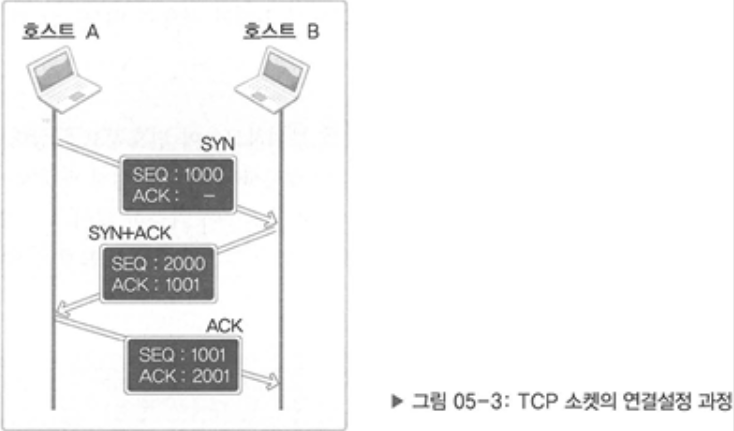
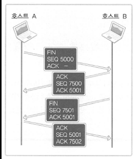

# 5장 TCP 기반 서버/클라이언트 2

## 05-1 에코 클라이언트의 완벽 구현!

### 전 에코 클라이언트의 문제점

전 에코 클라이언트의 소스코드에서 받아오는 부분의 입출력 문장은 다음과 같다.

```cpp
write(sock, messag, strlen(message));
str_len = read(sock, message, BUF_SIZE -1);
```

이 부분에서 문제가 있다고 볼 수 있는데 이 문장의 의도는 read 함수호출을 통해서 자신이 전송한 문자열 데이터를 한방에 수신하기를 원하고 있다는 것이다. 데이터의 경계가 불분명하기 때문에 언제 끊어야할 지, 언제 다들어오는 지가 불분명해진다. 이를 이치에 맞게 조정하려면 문자열 데이터가 전송되었을 때 이를 모두 읽어서 출력되도록 바꾸면 된다.

`echo_client2.c`

```cpp
#include <stdio.h>
#include <stdlib.h>
#include <string.h>
#include <unistd.h>
#include <arpa/inet.h>
#include <sys/socket.h>
#define BUF_SIZE 1024
void error_handling(char * message);

int main(int argc, char* argv[])
{
    int sock;
    char message[BUF_SIZE];
    int str_len, recv_len, recv_cnt;
    struct sockaddr_in serv_adr;

    if(argc!=3)
    {
        printf("Usage: %s <IP> <port> \n", argv[0]);
        exit(1);
    }

    sock = socket(PF_INET, SOCK_STREAM, 0);
    if(sock == -1)
    {
        error_handling("socket() error!");
    }

    memset(&serv_adr, 0, sizeof(serv_adr));
    serv_adr.sin_family = AF_INET;
    serv_adr.sin_addr.s_addr = inet_addr(argv[1]);
    serv_adr.sin_port = htons(atoi(argv[2]));

    if(connect(sock, (struct sockaddr*)&serv_adr, sizeof(serv_adr)) == -1)
        error_handling("connect() error!");
    else
    {
        puts("Connected.............");
    }

    while(1)
    {
        fputs("Input message(Q to quit): ", stdout);
        fgets(message, BUF_SIZE, stdin);
        if(!strcmp(message, "q\n") || !strcmp(message, "Q\n"))
            break;

        str_len = write(sock, message, strlen(message));

        recv_len = 0;
        while(recv_len < str_len)
        {
            recv_cnt = read(sock, &message[recv_len], BUF_SIZE-1);
            if(recv_cnt == -1)
                error_handling("read() error!");
            recv_len += recv_cnt;
        }
        message[recv_len] = 0;
        printf("Message from server: %s", message);
    }
    close(sock);
    return 0;
}

void error_handling(char* message)
{
    fputs(message, stderr);
    fputc('\n', stderr);
    exit(1);
}
```

> 43\~53행이 변경된 부분이다. 입출력 부분에서 while문을 삽입하며 문자열을 받은 길이가 자신이 보낸 문자열 만큼 길어졌을 때까지 반복을 진행하여 문자열 데이터가 모두 받았을 때, 문자열을 출력하도록 만들고 있다.

***

## 05-2 TCP의 이론적인 이야기!

### TCP 소켓에 존재하는 입출력 버퍼


* write 함수가 호출되면 출력버퍼라는 곳에 데이터가 전달되고, 상황에 맞게 데이터를 입력버퍼로 전송한다.
* 입출력 버퍼는 TCP 소켓 각각에 대해 별도로 존재한다.
* 입출력 버퍼는 소켓생성시 자동으로 생성된다.
* 소켓을 닫아도 출력버퍼에 남아있는 데이터는 계속해서 전송이 이뤄진다.
* 소켓을 닫으면 입력버퍼에 남아있는 데이터는 소멸되어버린다.

그렇다면 입력버퍼를 초과하는 값을 출력버퍼에서 보내면 어떻게 되는가? TCP인 경우 소켓들끼리 통신을 하기 때문에 입력버퍼를 초과하는 데이터는 전송하지 안흔ㄴ다.

#### TPC의 내부 동작원리1: 상대 소켓과의 연결

Three way handshaking

* 상대소켓과의 연결
* 상대 소켓과의 데이터 송수신
* 상대 소켓과의 연결종료



그림은 다음과 같은 순서로 이루어진다.

1.  (SYN) SEQ: 1000, ACK: -

    "내가 지금 보내는 이 패킷에 1000이라는 번호를 부여하니, 잘 받았다면 다음에는 1001번 패킷을 전달하라고 내게 말해달라!"
2.  (SYN+ACK) SEQ: 2000, ACK: 1001

    "내가 지금 보내는 이 패킷에 2000이라는 번호를 부여하니 잘 받았다면 다음에는 2001번 패킷을 전달하라고 내게 말해달라!" (SEQ 2000과 관련)"좀 전에 전송한 SEQ가 1000인 패킷은 잘 받았으니, 다음 번에는 SEQ가 1001인 패킷을 전송하기 바란다!" (ACK 1001과 관련)
3.  (ACK) SEQ: 1001, ACK: 2001

    "좀 전에 전송한 SEQ가 2000인 패킷은 잘 받았으니, 다음 번에는 SEQ가 2001인 패킷을 전송하기 바란다!"

#### TCP의 내부 동작원리2: 상대 소켓과의 데이터 송수신

> **ACK 번호 → SEQ 번호 + 전송된 바이트 크기 + 1**

TCP 소켓은 중간에 문제가 발생하여 SEQ에 대한 ACK메시지를 받지 못하였을 때 데이터의 손실에 대한 재전송을 위해 타이머를 동작시켜 Time out! 되었을 때 패킷을 재전송한다.

#### TCP의 내부 동작원리3: 상대 소켓과의 연결종료



Four-way handshaking

FIN 신호를 보내면 4단계에 걸쳐 연결을 종료시킨다.
